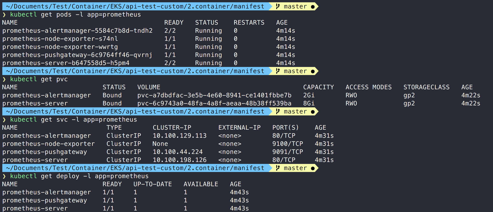

# Monitoring Public Repo Sample

## 가정 사항

- Elastic Kubernetes Service Engine Version: 1.15


## Basic Test

```bash
kubectl create namespace monitor
```

### Prometheus

#### Search

```bash
helm search repo prometheus
```

#### Install

```bash
helm install prometheus stable/prometheus
```

#### Result



#### Graph

```bash
kubectl port-forward svc/prometheus-server 8080:80 -n monitor
localhost:8080/targets
```


#### Pushgateway

```bash
export POD_NAME=$(kubectl get pods --namespace default -l "app=prometheus,component=pushgateway" -o jsonpath="{.items[0].metadata.name}")
kubectl --namespace default port-forward $POD_NAME 9091
```


### Grafana

#### Search

```bash
helm search repo grafana
```

### Install

#### Edit file (path: grafana/values.yaml)


```bash
helm install grafana stable/grafana -f values.yaml -n monitor
```

### Result


- Console Login

```bash
export POD_NAME=$(kubectl get pods --namespace monitor -l "app.kubernetes.io/name=grafana,app.kubernetes.io/instance=grafana" -o jsonpath="{.items[0].metadata.name}")
kubectl --namespace monitor port-forward $POD_NAME 3000
```

- username: admin
- password

```bash
kubectl get secret --namespace default grafana -o jsonpath="{.data.admin-password}" | base64 --decode ; echo
```


